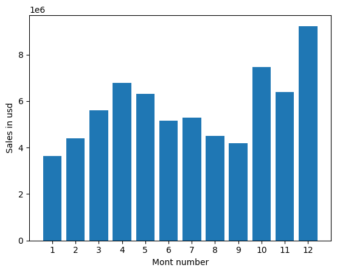
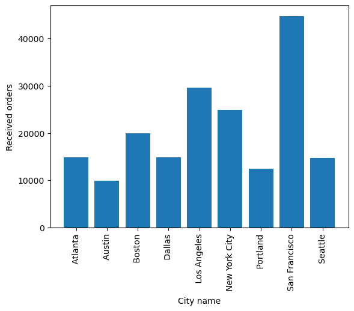
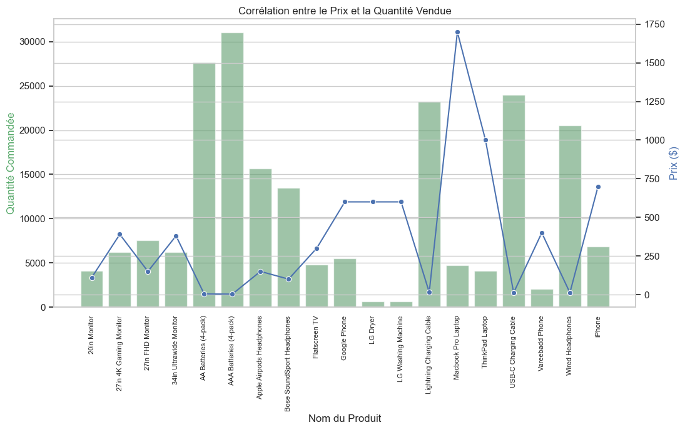
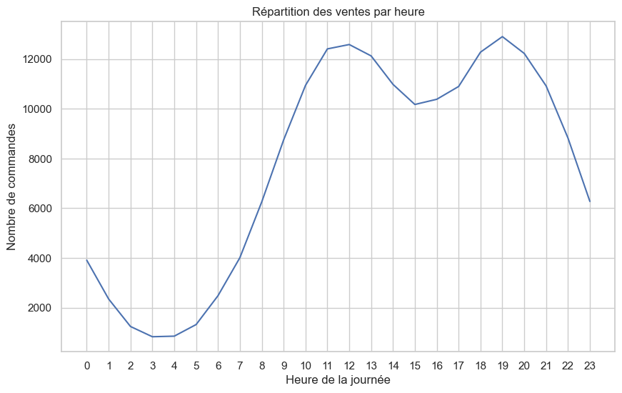
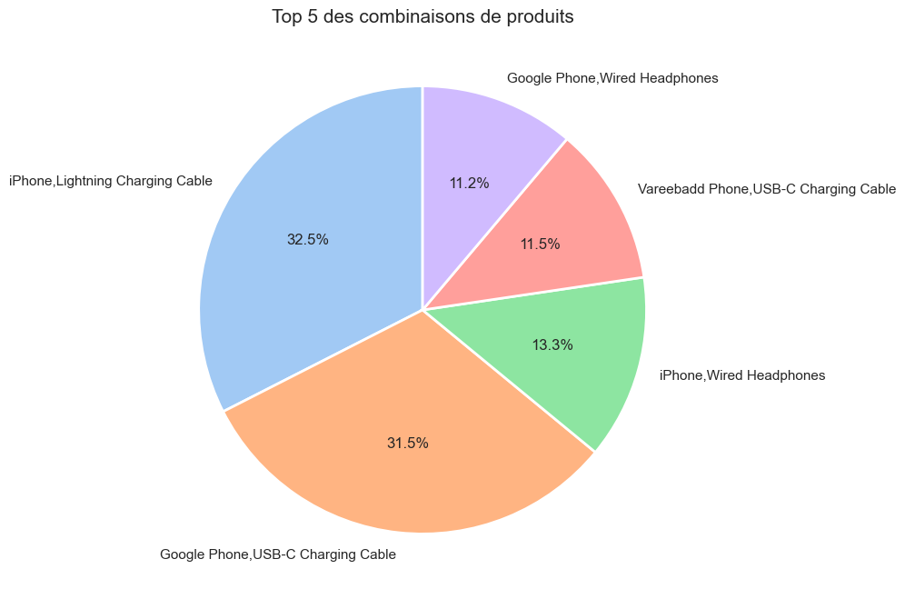

# 📊 Sales Data Analysis Project (Python)

## 📝 Project Overview
This project focuses on analyzing 12 months of sales data from an electronics store to identify trends, optimize advertising schedules, and understand customer purchasing behavior. 

The goal is to provide actionable insights for business growth using **Data Science** techniques.

## 🛠️ Technologies Used
- **Language:** Python 3
- **Libraries:** 
  - **Pandas:** Data cleaning and manipulation
  - **Seaborn & Matplotlib:** Data visualization
  - **Itertools & Collections:** Order grouping and product combination analysis

## 🔍 Key Business Questions Answered
1. **What was the best month for sales?** (Identified seasonality)
2. 

3. **What city sold the most product?** (Geographic performance)
4. 

5. **What time should we display advertisements?** (Optimizing peak hours)
8. **What products are most often sold together?** (Cross-selling opportunities)
10. **What is the correlation between price and quantity sold?**
    

## 💡 Key Insights
- **Advertising Peak:** The best times to display ads are around **11 AM** and **7 PM**.
- 
- **Product Bundles:** iPhones and Lightning Charging Cables are the most frequent combination.
- 
- **Price Sensitivity:** There is a clear inverse correlation between price and quantity sold for everyday items (batteries, cables).
- 

## 🚀 How to Run the Project
1. Clone this repository.
2. Ensure you have `pandas`, `seaborn`, and `matplotlib` installed.
3. Open `Analyse_des_ventes_python.ipynb` in Jupyter Notebook or Google Colab.

4. ## 🎯 Conclusion & Strategic Recommendations

Based on the data insights, I recommend the following actions for the business:

1. **Optimize Ad Spending:** Focus digital marketing campaigns between **10:00 AM - 12:00 PM** and **6:00 PM - 8:00 PM**. This aligns with peak ordering times when customers are most active.
2. **Strategic Product Bundling:** Since **iPhones and Lightning Charging Cables** are frequently bought together, create a "Starter Pack" promotion to increase the average order value.
3. **Inventory Management by City:** **San Francisco** shows the highest sales volume. Inventory levels should be prioritized for West Coast distribution centers to ensure faster shipping.
4. **Pricing Strategy:** Low-cost items (AA/AAA batteries, USB-C cables) drive the highest volume. These should be used as "add-on" suggestions at checkout to boost sales without significant marketing costs.

